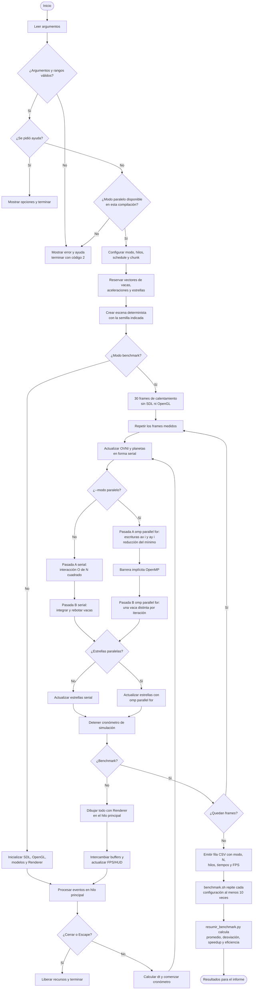

# Anexo 1 - Diagrama de flujo final

Este diagrama documenta el recorrido común de la versión serial y la versión
OpenMP. Ambas usan el mismo código y las mismas estructuras; `--modo` decide
si los lazos de simulación habilitan OpenMP.

## Puntos de sincronización y seguridad

- En la pasada A, cada iteración solo escribe `ax[i]` y `ay[i]`; las vacas se
  consultan en modo lectura.
- `reduction(min:distanciaMinimaOvni)` evita una condición de carrera al
  calcular el mínimo global.
- La barrera implícita al final del primer `parallel for` asegura que todas
  las aceleraciones existan antes de integrar posiciones en la pasada B.
- En la pasada B cada iteración modifica una vaca distinta. No se necesita
  `critical`, mutex ni bloqueo explícito.
- SDL, OpenGL, carga de recursos y `Renderer` permanecen en el hilo principal.

