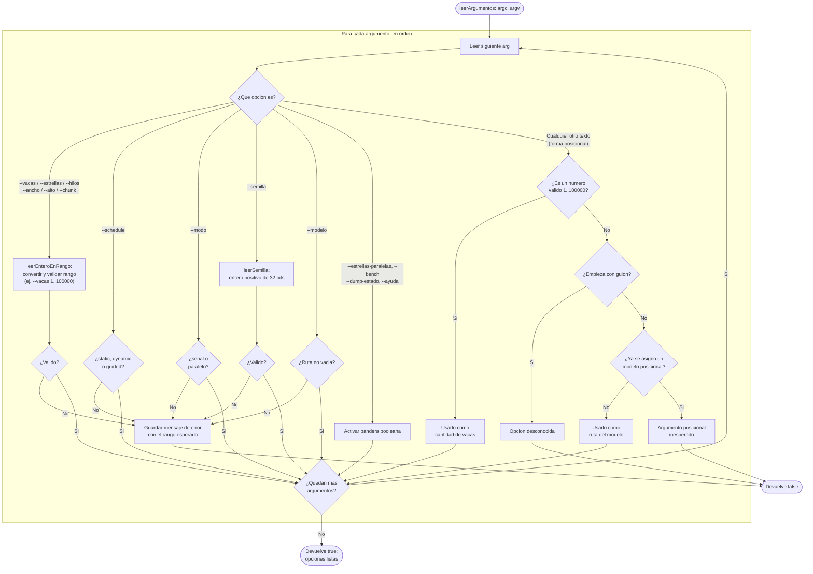
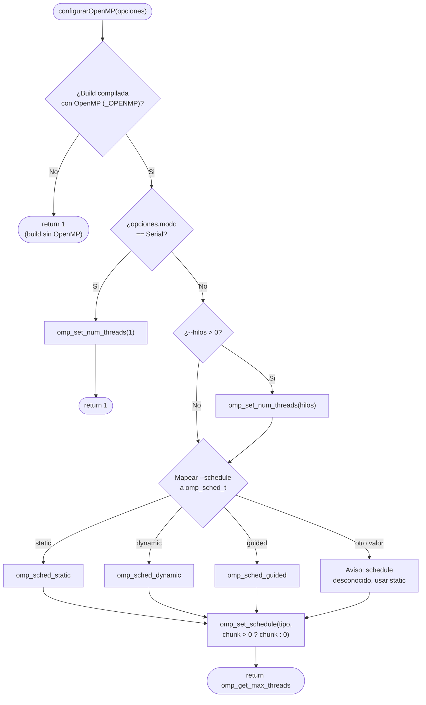
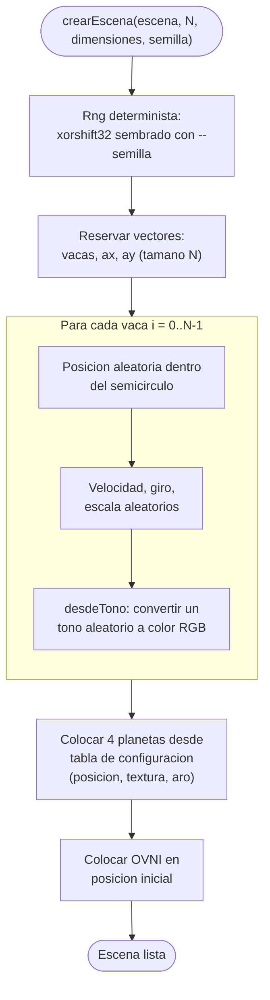
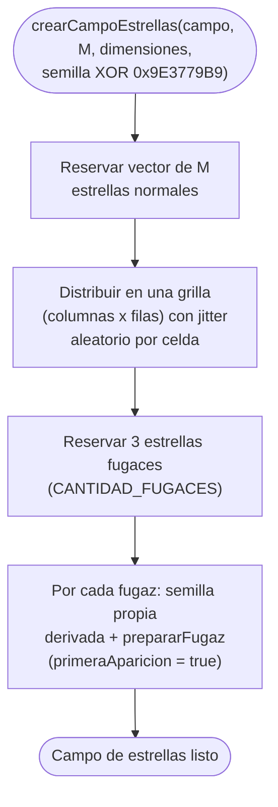
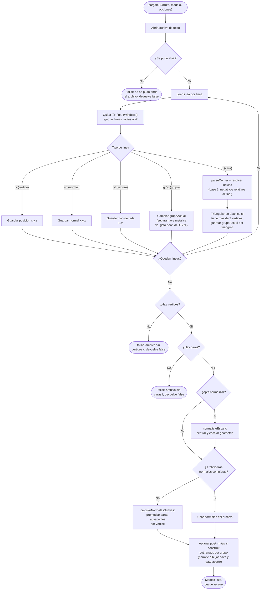
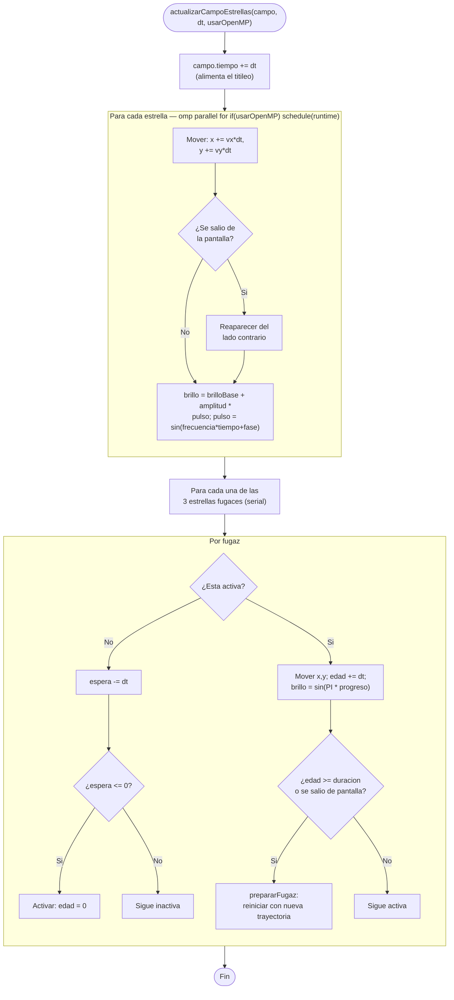
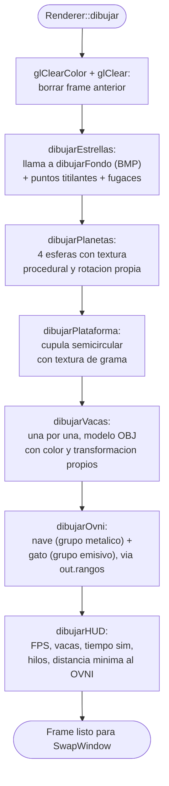
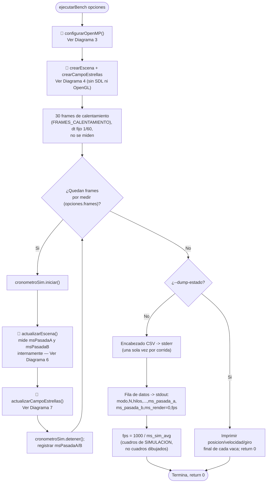

# Diagrama de flujo (Anexo 1)

Este documento reúne, en un solo lugar, el diagrama de flujo del **programa
principal** y los diagramas de flujo separados de cada función o archivo que
ese programa invoca. Es la versión pensada para anexar al informe como
**Anexo 1**.

El diagrama principal (sección 1) no repite la lógica interna de cada paso
complejo; en su lugar la nombra y remite, con el marcador 📄, al diagrama
correspondiente (secciones 2 a 9), igual que un programa real divide el
trabajo en funciones.

Todos los diagramas fueron verificados línea por línea contra el código
fuente actual (`src/main.cpp`, `src/simulation/scene.cpp`,
`src/simulation/starfield.cpp`, `src/assets/obj_loader.cpp`,
`src/rendering/renderer.cpp`).

## Índice de diagramas

| # | Diagrama | Archivo : función | Se llama desde | Prioridad |
|---|---|---|---|---|
| 1 | [Programa principal](#1-programa-principal-srcmaincpp) | `src/main.cpp : main` | — (punto de entrada) | Imprescindible |
| 2 | [`leerArgumentos` y validaciones](#2-leerargumentos-y-validaciones-srcmaincpp) | `src/main.cpp : leerArgumentos` | Diagrama 1, arranque | Complementario |
| 3 | [`configurarOpenMP`](#3-configuraropenmp-srcmaincpp) | `src/main.cpp : configurarOpenMP` | Diagrama 1 y Diagrama 9 | Imprescindible |
| 4 | [`crearEscena` y `crearCampoEstrellas`](#4-crearescena-y-crearcampoestrellas-inicializacion) | `src/simulation/scene.cpp`, `src/simulation/starfield.cpp` | Diagrama 1 y Diagrama 9 | Secundario |
| 5 | [Carga de modelos OBJ](#5-cargarobj-srcassetsobj_loadercpp) | `src/assets/obj_loader.cpp : cargarOBJ` | Diagrama 1, arranque (x2) | Complementario |
| 6 | [Actualizar escena (vacas, OVNI, planetas)](#6-actualizarescena-srcsimulationscenecpp) | `src/simulation/scene.cpp : actualizarEscena` | Diagrama 1 y Diagrama 9, cada frame | Imprescindible |
| 7 | [Actualizar campo de estrellas](#7-actualizarcampoestrellas-srcsimulationstarfieldcpp) | `src/simulation/starfield.cpp : actualizarCampoEstrellas` | Diagrama 1 y Diagrama 9, cada frame | Imprescindible |
| 8 | [Dibujar un frame](#8-rendererdibujar-srcrenderingrenderercpp) | `src/rendering/renderer.cpp : Renderer::dibujar` | Diagrama 1, cada frame | Complementario |
| 9 | [Modo benchmark](#9-modo-benchmark-ejecutarbench-srcmaincpp) | `src/main.cpp : ejecutarBench` | Diagrama 1, en vez del loop con ventana | Imprescindible |

Los cinco diagramas marcados **Imprescindible** (1, 3, 6, 7, 9) están además
extraídos, listos para pegar en el cuerpo del informe, en
`docs/imprescindibles.md`.

---

## 1. Programa principal (`src/main.cpp`)

Cubre `main()`: desde que arranca el proceso hasta que se cierra la ventana.
Los pasos marcados con 📄 llaman a una función que tiene su propio diagrama
en otra sección de este documento.

```mermaid
flowchart TD
    A([Inicio: ./zipzip argumentos]) --> B["📄 leerArgumentos()\nVer Diagrama 2"]
    B --> C{¿Argumentos validos?}
    C -- No --> D[Imprimir error + ayuda\nterminar codigo 2]
    C -- Si --> E{"¿--ayuda?"}
    E -- Si --> F[imprimirAyuda\nterminar codigo 0]
    E -- No --> G{"¿Build sin OpenMP\ny se pidio --modo paralelo?"}
    G -- Si --> D
    G -- No --> H{"¿--modo serial\ny --estrellas-paralelas?"}
    H -- Si --> D
    H -- No --> I{"¿--bench?"}

    I -- Si --> BENCH["📄 ejecutarBench()\nVer Diagrama 9"]
    BENCH --> FINBENCH([Termina: imprime CSV o dump])

    I -- No --> J[SDL_Init]
    J --> K{¿Error?}
    K -- Si --> ERR_INIT([return 1\nnada que liberar aun])
    K -- No --> L["SDL_GL_SetAttribute x2:\nDOUBLEBUFFER, DEPTH_SIZE 24"]
    L --> M[SDL_CreateWindow 900x700]
    M --> N{¿Error creando\nventana?}
    N -- Si --> ERR_WIN([SDL_Quit\nreturn 1])
    N -- No --> O[SDL_GL_CreateContext]
    O --> P{¿Error creando\ncontexto?}
    P -- Si --> ERR_CTX([SDL_DestroyWindow\nSDL_Quit, return 1])
    P -- No --> Q["SDL_GL_SetSwapInterval 0:\nsin VSync, a proposito"]
    Q --> R["📄 cargarOBJ cow.obj\nVer Diagrama 5"]
    R --> S{¿Error cargando\nmodelo de vaca?}
    S -- Si --> ERR_MODEL(["SDL_GL_DeleteContext\nSDL_DestroyWindow\nSDL_Quit, return 1"])
    S -- No --> T["📄 cargarOBJ ufo_gato.obj\nVer Diagrama 5"]
    T --> U{¿Error cargando\nmodelo del OVNI?}
    U -- Si --> ERR_MODEL
    U -- No --> V["📄 configurarOpenMP()\nVer Diagrama 3"]
    V --> W["Renderer: constructor +\ninicializar (setup OpenGL\nde una sola vez)"]
    W --> X["📄 crearEscena + crearCampoEstrellas\nVer Diagrama 4"]
    X --> LOOP

    subgraph LOOP["Loop principal — se repite cada frame"]
        direction TB
        L1[procesarEventos] --> L2{¿Cerrar ventana\no tecla Esc?}
        L2 -- Si --> LEXIT[Salir del loop]
        L2 -- No --> L3["Calcular dt desde el frame\nanterior; recortar a maximo 0.1s"]
        L3 --> L4{"¿Pasaron 0.25s\ndesde la ultima medicion\n(VENTANA_FPS)?"}
        L4 -- Si --> L5["Recalcular FPS, actualizar\ntitulo de ventana,\nlimpiar cronometros"]
        L4 -- No --> L6
        L5 --> L6["cronometroSim.iniciar()"]
        L6 --> L7["📄 actualizarEscena()\nVer Diagrama 6"]
        L7 --> L8["📄 actualizarCampoEstrellas()\nVer Diagrama 7"]
        L8 --> L9["cronometroSim.detener()"]
        L9 --> L10["cronometroRender.iniciar()"]
        L10 --> L11["📄 renderer.dibujar()\nVer Diagrama 8"]
        L11 --> L12["SDL_GL_SwapWindow:\nmostrar el frame"]
        L12 --> L13["cronometroRender.detener()"]
        L13 --> L1
    end

    LEXIT --> Y[renderer.liberarRecursos]
    Y --> Z["SDL_GL_DeleteContext\nSDL_DestroyWindow\nSDL_Quit"]
    Z --> FIN([Programa terminado, codigo 0])
```

### Notas del diagrama principal

- Cada punto de error de inicialización libera **solo lo que ya se había
  creado** hasta ese momento (`SDL_Init` fallido no libera nada;
  `cargarOBJ` fallido libera contexto, ventana y SDL) — es el patrón manual
  de limpieza que usa el proyecto en vez de RAII.
- `actualizarEscena` y `actualizarCampoEstrellas` (Diagramas 6 y 7) son los
  únicos pasos que usan `#pragma omp parallel for`; todo lo demás corre
  siempre en un solo hilo.
- `renderer.dibujar` (Diagrama 8) permanece siempre en el hilo principal
  porque OpenGL solo acepta instrucciones una a la vez.
- `cargarOBJ` (Diagrama 5) se ejecuta dos veces, antes de crear la escena,
  no en cada frame.
- La actualización de FPS/título ocurre **antes** de simular y dibujar el
  frame actual (usa los tiempos acumulados de la ventana anterior), no
  después.

---

## 2. `leerArgumentos` y validaciones (`src/main.cpp`)

Se invoca una sola vez, al arrancar, desde el Diagrama 1 (paso B). Recorre
`argv` y valida cada opción de forma defensiva antes de aceptarla.

Después de que `leerArgumentos` devuelve `true`, el Diagrama 1 encadena tres
validaciones adicionales que dependen de **combinaciones** de opciones, no de
una sola: `--ayuda` (nodo E), build sin OpenMP más `--modo paralelo` (nodo
G), y `--modo serial` más `--estrellas-paralelas` (nodo H).

---

## 3. `configurarOpenMP` (`src/main.cpp`)

Se invoca una vez, después de cargar los modelos, desde el Diagrama 1 (rama
con ventana) o desde el Diagrama 9 (modo benchmark). Decide cuántos hilos se
usan y con qué política de reparto.

Esta es la única función que fija hilos y schedule. Los `#pragma omp
parallel for` de los Diagramas 6 y 7 usan siempre `schedule(runtime)`, así
que leen la política definida aquí — eso es lo que permite comparar
`static`/`dynamic`/`guided` y distintos `--chunk` desde la línea de comandos
sin recompilar.

---

## 4. `crearEscena` y `crearCampoEstrellas` (inicialización)

Se invocan una sola vez, justo antes de entrar al loop principal (Diagrama 1)
o al bucle de benchmark (Diagrama 9). Usan un generador determinista
(`xorshift32`) sembrado con `--semilla`, para que una corrida serial y una
paralela con la misma semilla sean comparables byte a byte
(`--dump-estado`).

La semilla de las estrellas se deriva con `semilla XOR 0x9E3779B9` para que
vacas y estrellas no compartan la misma secuencia pseudoaleatoria aunque
usen la misma `--semilla` de entrada.

---

## 5. `cargarOBJ` (`src/assets/obj_loader.cpp`)

Se invoca dos veces desde el Diagrama 1 (una por modelo: vaca y OVNI), antes
de entrar al loop principal.

Este mismo proceso se usa para `cow.obj` y para `ufo_gato.obj`. Los grupos
`g`/`o` de este último (`nave`, `gato`) quedan guardados en `out.rangos`, lo
que permite que `Renderer::dibujarOvni` (Diagrama 8) dibuje cada parte con
su propio material sin volver a tocar el archivo.

---

## 6. `actualizarEscena` (`src/simulation/scene.cpp`)

Se invoca una vez por frame desde el Diagrama 1 (paso L7) o el Diagrama 9.
Mueve el OVNI, las vacas (en dos pasadas paralelizables) y los 4 planetas, y
mide por separado el costo de cada pasada.

```mermaid
flowchart TD
    START(["actualizarEscena(escena, dt, usarOpenMP, msPasadaA*, msPasadaB*)"]) --> OVNI["Mover OVNI: trayectoria de\nLissajous (serial, O(1))"]

    OVNI --> INICIOA["Iniciar cronometro\nde la Pasada A"]
    INICIOA --> PASADA_A

    subgraph PASADA_A["Pasada A — omp parallel for if(usarOpenMP)\nschedule(runtime) reduction(min:distanciaMinimaOvni)"]
        direction TB
        A1["Para cada vaca i (en paralelo):\naceleracionX/Y locales = 0"] --> A2["Comparar contra\ncada vecina j != i"]
        A2 --> A3{"¿distancia^2 < radioSeparacion^2\ny > 0?"}
        A3 -- Si --> A4["Acumular empuje en las\nlocales aceleracionX/Y\n(no toca memoria compartida aun)"]
        A3 -- No --> A5[No acumula nada]
        A4 --> A6{¿Quedan vecinas?}
        A5 --> A6
        A6 -- Si --> A2
        A6 -- No --> A7["Distancia de ESTA vaca al OVNI;\nactualizar minimo local\n(una vez por vaca, no por vecina)"]
        A7 --> A8["Escribir UNA sola vez:\nax[i] = aceleracionX, ay[i] = aceleracionY\n(evita false sharing)"]
    end

    PASADA_A --> FINA["e.distanciaMinimaOvni = minimo global\n(reduction combina los minimos por hilo);\ndetener cronometro Pasada A"]

    FINA -->|"barrera implicita\nOpenMP"| INICIOB["Iniciar cronometro\nde la Pasada B"]
    INICIOB --> PASADA_B

    subgraph PASADA_B["Pasada B — omp parallel for if(usarOpenMP) schedule(runtime)"]
        direction TB
        B1[Para cada vaca i,\nen paralelo] --> B2["vx,vy += (ax[i],ay[i] de Pasada A)\n+ cohesion hacia cohesionCentroY"]
        B2 --> B3{"¿Rapidez excede\nrapidezMax?"}
        B3 -- Si --> B4[Reescalar vx,vy\nal limite]
        B3 -- No --> B5
        B4 --> B5["Actualizar giro\n(wrap 0..360)"]
        B5 --> B6["Integrar posicion:\nx += vx*dt, y += vy*dt"]
        B6 --> B7{"¿Fuera del circulo\n(borde curvo)?"}
        B7 -- No --> B9
        B7 -- Si --> B8{"¿La velocidad aun\napunta hacia afuera?"}
        B8 -- Si --> B8B["Reflejar: v' = v - 2(v.n)n\n(evita vibracion en el borde)"]
        B8 -- No --> B8C[No reflejar velocidad]
        B8B --> B8D["Reproyectar a un punto\nligeramente interior\n(margen anti doble-choque)"]
        B8C --> B8D
        B8D --> B9{"¿Cruzo la linea\nplana inferior?"}
        B9 -- Si --> B10["Rebote elastico simple:\nvy = -vy, y = circuloCentroY"]
        B9 -- No --> B11[Sigue igual]
        B10 --> B11
    end

    PASADA_B --> FINB["Detener cronometro\nde la Pasada B"]
    FINB --> PLANETAS["Para cada uno de los 4 planetas:\ntrasladar x += vx*dt, rotar giro,\ny hacer wrap en +-limite\n(serial: muy pocos elementos)"]
    PLANETAS --> FIN([Fin del frame de simulacion])
```

**Por qué dos pasadas:** en la Pasada A cada vaca solo *lee* a las demás y
escribe únicamente su propia `ax[i]`/`ay[i]` **una vez**, al salir del lazo
de vecinas; en la Pasada B cada vaca solo toca su propio dato. Ningún hilo
lee lo que otro está escribiendo al mismo tiempo, así que no hace falta
`critical` ni mutex, y el resultado con 1 hilo es idéntico al resultado con
N hilos (verificable con `--dump-estado`).

---

## 7. `actualizarCampoEstrellas` (`src/simulation/starfield.cpp`)

Se invoca una vez por frame desde el Diagrama 1 (paso L8) o el Diagrama 9,
justo después de `actualizarEscena`. Solo usa OpenMP si se pasa
`--estrellas-paralelas`.

Cada estrella es independiente de las demás (a diferencia de las vacas), por
lo que no necesita el truco de dos pasadas. Con las ~180 estrellas por
defecto, el overhead de crear el equipo de hilos suele superar la ganancia;
por eso el paralelismo aquí es opt-in con `--estrellas-paralelas`.

---

## 8. `Renderer::dibujar` (`src/rendering/renderer.cpp`)

Se invoca una vez por frame desde el Diagrama 1 (paso L11), después de que
la simulación ya calculó las posiciones nuevas. Corre íntegramente en el
hilo principal porque OpenGL solo acepta instrucciones en orden, una a la
vez.

**Por qué ese orden:** se dibuja de lo más lejano a lo más cercano (pintor
por capas) para que los objetos en frente tapen correctamente lo que está
detrás; el HUD va siempre al final para quedar encima de todo.

`configurarProyeccion`, `prepararEsferaPlaneta`, `prepararTexturasPlanetas`
y `prepararTexturasEscena` corren una sola vez dentro de `inicializar()`
(Diagrama 1, paso W) — no se repiten en cada `dibujar()`.

---

## 9. Modo benchmark: `ejecutarBench` (`src/main.cpp`)

Se invoca desde el Diagrama 1 en vez del loop con ventana, cuando se pasa
`--bench`. Reutiliza `actualizarEscena` (Diagrama 6) y
`actualizarCampoEstrellas` (Diagrama 7), pero nunca llama a `Renderer` ni a
SDL/OpenGL — así se puede subir `N` mucho más alto sin que dibujar sea el
cuello de botella.

El encabezado va a **stderr** y la fila de datos a **stdout** a propósito:
`scripts/benchmark.sh` llama a este modo al menos 10 veces por configuración
(serial vs. paralelo, distintos `N`, hilos, schedule y chunk) y concatena
las filas de `stdout` en un solo CSV sin repetir el encabezado.
`scripts/resumir_benchmark.py` calcula promedio, speedup y eficiencia a
partir de ese CSV.

---

## Puntos de sincronización y seguridad

- En la Pasada A (Diagrama 6), cada iteración solo escribe `ax[i]` y
  `ay[i]`, y lo hace una única vez al salir del lazo de vecinas; las vacas
  se consultan siempre en modo lectura.
- `reduction(min:distanciaMinimaOvni)` evita una condición de carrera al
  calcular el mínimo global: cada hilo lleva su propio mínimo parcial y
  OpenMP los combina de forma segura al salir del lazo.
- La barrera implícita al final del primer `parallel for` garantiza que
  toda aceleración (`ax`/`ay`) esté lista antes de que la Pasada B empiece a
  integrar posiciones.
- En la Pasada B cada iteración modifica una vaca distinta (su propia
  posición, velocidad y giro). No se necesita `critical`, mutex ni bloqueo
  explícito porque no hay dos hilos escribiendo el mismo dato.
- `actualizarCampoEstrellas` (Diagrama 7) sigue el mismo principio: cada
  estrella es independiente y solo se modifica a sí misma.
- SDL, OpenGL, la carga de recursos y todo `Renderer` permanecen siempre en
  el hilo principal (Diagramas 1, 5 y 8).

## Ver también

- `docs/imprescindibles.md` — extracto autocontenido con los 5 diagramas
  imprescindibles (1, 3, 6, 7, 9), listo para el cuerpo del informe.
- La serie `docs/flujo_01_vision_general.md` a `flujo_04_paralelizacion_openmp.md`
  explica lo mismo con lenguaje llano y analogías, pensada para quien no
  programa.
- `docs/anexo_02_catalogo_funciones.md` — catálogo completo de funciones,
  entradas y salidas.
