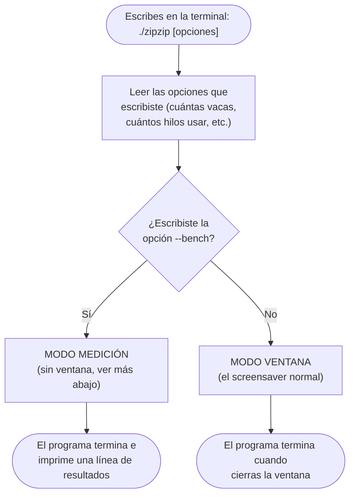
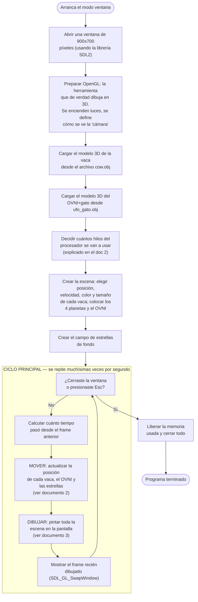
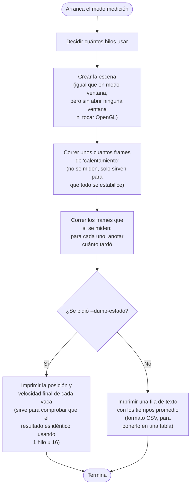

# Cómo funciona ZipZip — Visión general

Esta es una guía pensada para alguien que **no programa** (o programa poco) y
quiere entender qué hace el programa de principio a fin, sin necesidad de leer
código C++.

Hay cuatro documentos, cada uno viendo el programa con más o menos zoom:

1. **Este documento** — el recorrido completo, de arriba a abajo: qué pasa
   desde que escribes `./zipzip` hasta que se cierra la ventana.
2. [`flujo_02_simulacion.md`](flujo_02_simulacion.md) — el "cerebro" del
   programa: cómo deciden las vacas hacia dónde moverse, y qué es eso de
   "paralelizar con varios hilos".
3. [`flujo_03_renderizado.md`](flujo_03_renderizado.md) — cómo esos números
   (posiciones, colores) se convierten en la imagen que ves en pantalla.
4. [`flujo_04_paralelizacion_openmp.md`](flujo_04_paralelizacion_openmp.md) —
   el mapa exacto: los 4 lugares del código donde de verdad se reparte
   trabajo entre varios hilos, con archivo y número de línea, más por qué el
   resto del programa **no** lo hace.

No hace falta leer los cuatro para entender el primero — pero si algo de este
documento te deja con ganas de más detalle, ahí está el siguiente paso.

## ¿Qué es ZipZip, en una frase?

Es un programa que dibuja una escena en 3D (vacas caminando sobre una
plataforma con forma de medio planeta, un OVNI que las sobrevuela, estrellas
de fondo) y la actualiza **60 veces por segundo o más**, dando la sensación de
movimiento — como una película, pero calculada en vivo en vez de grabada de
antemano.

Cada una de esas actualizaciones se llama **frame** (cuadro). El programa
hace, sin parar, dos cosas por cada frame:

- **Mover** todo un poquito (las vacas caminan, el OVNI vuela, las estrellas
  titilan).
- **Dibujar** el resultado en la pantalla.

Todo este documento es, en el fondo, la explicación de ese ciclo:
mover → dibujar → mover → dibujar → ... miles de veces, hasta que cierras la
ventana.

## El punto de partida: dos formas de arrancar el programa

Antes de llegar al ciclo mover/dibujar, el programa decide **para qué lo
estás usando**. Tiene dos modos:

- **Modo ventana** (el normal): abre una ventana y te deja ver el
  screensaver. Es lo que pasa si simplemente escribes `./zipzip`.
- **Modo medición** (`--bench`): no abre ninguna ventana. En vez de eso,
  mueve la simulación muchas veces lo más rápido posible, mide cuánto tarda,
  y al final imprime esos números. Este modo existe porque el proyecto
  necesita **comparar qué tan rápido es el programa** usando 1 núcleo del
  procesador contra usando 8 o 16 al mismo tiempo — y para medir eso bien, es
  mejor no perder tiempo dibujando nada.

## Modo ventana: el recorrido completo

Este es el diagrama principal. Cada caja es un paso; las flechas indican el
orden en que ocurren. La parte de en medio (el rectángulo punteado) es el
**ciclo que se repite sin parar** mientras la ventana está abierta.

### Notas sobre cada paso, en español llano

- **Abrir la ventana**: usa una librería llamada **SDL2**, que es la que sabe
  hablar con el sistema operativo para crear una ventana, leer el teclado, etc.
  El programa no tiene que reinventar eso desde cero.
- **Preparar OpenGL**: OpenGL es la herramienta que sabe convertir
  coordenadas 3D (x, y, z) en píxeles de colores en la pantalla. "Encender
  luces" y "definir la cámara" son configuraciones que le dicen a OpenGL desde
  dónde se está viendo la escena y cómo se debe iluminar.
- **Cargar los modelos**: los archivos `.obj` son archivos de texto que
  describen la forma 3D de la vaca y del OVNI (una lista de puntos en el
  espacio y cómo conectarlos para formar triángulos). El programa los lee una
  sola vez, al principio — no en cada frame, sería un desperdicio.
- **Decidir cuántos hilos usar**: esto tiene que ver con la parte de
  "paralelización" del proyecto. Se explica en detalle en el documento 2, pero
  la idea corta es: un procesador moderno tiene varios "núcleos" que pueden
  trabajar al mismo tiempo, y el programa puede repartir el trabajo de mover
  las vacas entre ellos para ir más rápido.
- **Crear la escena**: aquí se decide, al azar (pero de forma controlada, ver
  doc 2), dónde empieza cada vaca, hacia dónde se mueve, de qué color es, etc.
  Solo pasa una vez, al inicio.
- **El ciclo principal**: esta es la parte que se repite. Cada vuelta del
  ciclo es un frame. Si la ventana corre a 60 FPS ("frames per second",
  cuadros por segundo), este ciclo se repite 60 veces cada segundo — pero
  como este programa quita el límite de velocidad (ver más abajo, "VSync"),
  puede llegar a repetirse miles de veces por segundo si hay pocas vacas.

### ¿Qué es el "VSync" y por qué está apagado?

Normalmente, un videojuego limita sus frames a los que el monitor puede
mostrar (usualmente 60 por segundo) — eso se llama **VSync**. Si no lo hiciera,
estaría dibujando frames que nadie llega a ver, desperdiciando el procesador.

Este proyecto **apaga el VSync a propósito** (`SDL_GL_SetSwapInterval(0)` en el
código). ¿Por qué? Porque el objetivo del proyecto es medir qué tan rápido
puede ir el programa — y si el programa está limitado a 60 FPS de todas
formas, no se nota la diferencia entre usar 1 hilo o 16. Sin ese límite, los
FPS que se muestran en el título de la ventana reflejan de verdad qué tan
rápido está corriendo la simulación.

## Modo medición (`--bench`): el mismo trabajo, sin dibujar

Este modo es clave para el proyecto: como no dibuja nada, se puede subir la
cantidad de vacas a números enormes (decenas de miles) sin que la parte de
dibujar la pantalla estorbe la medición. Así se puede comparar de forma justa
"¿cuánto tarda mover todas las vacas usando 1 hilo, contra usando 16?".

## ¿Qué archivo del código corresponde a cada parte?

Para quien sí quiera después mirar el código, esta es la ubicación de cada
pieza:

| Lo que hace | Archivo |
|---|---|
| Todo lo de este documento (arranque, ciclo principal, modo medición) | `src/main.cpp` |
| Cargar archivos `.obj` | `src/assets/obj_loader.cpp` |
| Mover las vacas, el OVNI, los planetas (documento 2) | `src/simulation/scene.cpp` |
| Mover las estrellas (documento 2) | `src/simulation/starfield.cpp` |
| Dibujar todo en pantalla (documento 3) | `src/rendering/renderer.cpp` |

## Siguiente paso

Sigue con [`flujo_02_simulacion.md`](flujo_02_simulacion.md) para entender
cómo deciden las vacas hacia dónde caminar, y qué significa "paralelizar con
OpenMP" — el tema central de este proyecto.
