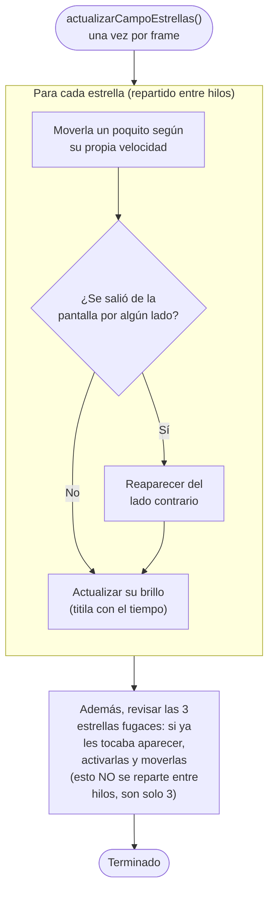

# Cómo funciona ZipZip — La simulación (mover las vacas)

Este documento asume que ya leíste
[`flujo_01_vision_general.md`](flujo_01_vision_general.md). Aquí nos metemos
en el paso que ahí se llamó "MOVER" — la parte más importante del proyecto,
porque es donde se usa la **paralelización** (usar varios núcleos del
procesador a la vez).

Todo lo de este documento vive en dos archivos:

- `src/simulation/scene.cpp` — las vacas, el OVNI y los planetas.
- `src/simulation/starfield.cpp` — las estrellas de fondo.

## Primero, una idea clave: "hilos" y "paralelizar"

Antes de entrar al diagrama, una explicación rápida para quien no haya oído
estos términos:

Un procesador moderno no tiene un solo "cerebro" haciendo cuentas — tiene
varios, llamados **núcleos**, que pueden trabajar **al mismo tiempo**, cada
uno en una tarea distinta. Un **hilo** (*thread* en inglés) es, en la
práctica, "un trabajador" al que el programa le puede repartir una porción
del trabajo.

Analogía: imagina que tienes que revisar 3,000 vacas, una por una, para
decidir hacia dónde debería moverse cada una. Si lo haces tú solo, tardas
cierto tiempo. Si contratas a 8 personas y cada una revisa 375 vacas (3,000
÷ 8) **al mismo tiempo**, en teoría el trabajo se hace hasta 8 veces más
rápido. Eso es, en esencia, lo que hace **OpenMP** en este proyecto: una
herramienta que le dice al programa "reparte este `for` (este "para cada
vaca, hacer...") entre varios hilos en vez de hacerlo uno por uno".

En el código, esto se ve como una línea que empieza con `#pragma omp parallel
for` puesta justo antes de un bucle. Es, literalmente, la instrucción
"reparte lo que sigue entre los hilos disponibles".

## El truco importante: por qué hay dos pasadas, no una

Si le dijeras a tus 8 ayudantes "revisen cada vaca, y si está muy cerca de
otra, muévanla" — tendrías un problema: mientras el ayudante A está moviendo
la vaca #5, el ayudante B podría estar *leyendo* la posición de esa misma
vaca #5 para decidir qué hacer con la vaca #200 (si están cerca). Si A ya la
movió y B todavía no, o al revés, **el resultado depende de quién llegó
primero** — y eso es información que no se puede predecir ni repetir. Dos
corridas del mismo programa (o la misma corrida con distinta cantidad de
hilos) podrían dar resultados ligeramente distintos.

Este proyecto necesita **evitar eso a toda costa**, porque uno de sus
objetivos es poder comparar "corrida con 1 hilo" contra "corrida con 16
hilos" y comprobar que dan **exactamente el mismo resultado** (ver
`--dump-estado` en el documento 1). Si el resultado pudiera variar por culpa
del orden en que los hilos hacen su trabajo, esa comparación no tendría
sentido.

La solución: partir el trabajo en **dos pasadas separadas**, para que nunca
un hilo esté leyendo algo que otro hilo está escribiendo al mismo tiempo:

- **Pasada A** — cada vaca *solo lee* la posición de las demás (nunca la
  cambia) y anota, en una libreta aparte, "yo debería acelerar hacia allá".
  Como nadie escribe sobre lo que otro está leyendo, no importa en qué orden
  ni en cuántos hilos se haga: el resultado es siempre igual.
- **Pasada B** — ya con esa libreta lista, cada vaca *se mueve a sí misma*
  según lo que anotó. Cada vaca solo toca su propio dato, nunca el de otra —
  así que, otra vez, no importa el orden.

## Diagrama completo de un frame de simulación

```mermaid
flowchart TD
    START(["actualizarEscena() se llama\nuna vez por frame"]) --> OVNI["Mover el OVNI un poquito\nsiguiendo su trayectoria\n(esto es barato, no se reparte\nentre hilos)"]

    OVNI --> PASADA_A

    subgraph PASADA_A["PASADA A — repartida entre los hilos"]
        direction TB
        A1["Tomar la siguiente vaca de la lista\n(cada hilo toma una porción\ndistinta de la lista)"] --> A2["Mirar a TODAS las demás vacas,\nuna por una"]
        A2 --> A3{"¿Esa otra vaca está\nmuy cerca (menos de\n'radioSeparacion')?"}
        A3 -->|"Sí"| A4["Anotar: empujar en\ndirección contraria a ella\n('separación')"]
        A3 -->|"No"| A5["Anotar: no hacer nada\npor esta vecina"]
        A4 --> A6{"¿Ya revisó a\ntodas las demás?"}
        A5 --> A6
        A6 -->|"No"| A2
        A6 -->|"Sí"| A7["Guardar el empuje total\nacumulado (nada se mueve\ntodavía)"]
    end

    PASADA_A --> PASADA_B

    subgraph PASADA_B["PASADA B — repartida entre los hilos"]
        direction TB
        B1["Tomar la siguiente vaca"] --> B2["Sumarle a su velocidad:\nel empuje de la Pasada A +\nun jaloncito hacia el\ncentro de la manada ('cohesión')"]
        B2 --> B3{"¿Quedó yendo\ndemasiado rápido?"}
        B3 -->|"Sí"| B4["Frenarla un poco"]
        B3 -->|"No"| B5["Mover la vaca según\nsu velocidad"]
        B4 --> B5
        B5 --> B6{"¿Se salió del\nborde curvo del\nsemicírculo?"}
        B6 -->|"Sí"| B7["Rebotar: invertir la parte\nde la velocidad que\napuntaba hacia afuera"]
        B6 -->|"No"| B8{"¿Cruzó la línea\nplana de abajo?"}
        B7 --> B8
        B8 -->|"Sí"| B9["Rebotar contra esa línea\ny devolverla justo arriba"]
        B8 -->|"No"| B10["Listo, siguiente vaca"]
        B9 --> B10
    end

    PASADA_B --> PLANETAS["Mover los 4 planetas\n(esto también es barato,\nsolo son 4, no vale la pena\nrepartirlo entre hilos)"]
    PLANETAS --> FIN(["Frame de simulación\nterminado"])
```

### ¿Por qué las vacas no se quedan todas amontonadas en un punto?

Fíjate que hay **dos fuerzas que compiten**:

- **Separación** (Pasada A): si una vaca está muy cerca de otra, la empuja
  para alejarla. Esto por sí solo haría que las vacas se esparcieran cada vez
  más lejos, hasta chocar contra el borde y quedarse ahí pegadas.
- **Cohesión** (Pasada B): un jaloncito constante y suave hacia un punto
  cómodo del centro de la plataforma. Esto evita que la separación las mande
  a todas hacia el borde.

El resultado de esas dos fuerzas jalando en direcciones opuestas es lo que
hace que la manada se vea repartida de forma pareja por toda la superficie,
en vez de amontonada en el centro o pegada al borde.

### ¿Qué es eso del "borde curvo" y la "línea plana de abajo"?

La plataforma no es un círculo completo — es un **semicírculo** que nace del
borde inferior de la pantalla (como el horizonte de un planeta pequeño). Eso
significa que hay dos formas de "salirse":

1. Alejarse demasiado del centro del círculo → se rebota contra el **borde
   curvo** (el arco).
2. Cruzar hacia la mitad de abajo del círculo (que ni siquiera se dibuja) →
   se rebota contra una **línea recta**, el diámetro del círculo.

## Las estrellas: una versión mucho más simple

El campo de estrellas (`starfield.cpp`) sigue la misma idea de "repartir
entre hilos", pero es mucho más sencillo porque **cada estrella es
completamente independiente de las demás** — no hay nada parecido a la
"separación" entre vacas.

Como cada estrella es independiente, no hace falta el truco de "dos
pasadas" que sí necesitan las vacas — no hay ningún riesgo de que un hilo
lea el dato de otra estrella a medio actualizar, porque nunca se leen entre
sí.

## Comparación: ¿por qué las vacas son "caras" y las estrellas son "baratas"?

Esta diferencia es, en realidad, el punto central del proyecto — la razón de
ser de todo el trabajo de medición que se explicó en el documento 1.

| | Vacas (Pasada A) | Estrellas / Pasada B de vacas |
|---|---|---|
| ¿Cuántas veces mira a otros datos? | Mira a **todas las demás vacas**, una por una | Nunca mira a nadie más |
| ¿Cómo crece el trabajo si subo la cantidad? | Si hay el doble de vacas, el trabajo se **cuadruplica** (cada vaca mira al doble de vecinas, y hay el doble de vacas) | Si hay el doble de estrellas, el trabajo se **duplica**, nada más |
| ¿Vale la pena repartir entre muchos hilos? | Sí, mucho — hay bastante trabajo real (cuentas matemáticas) por cada vaca | Poco — cada estrella es tan barata de mover que a veces ni vale la pena repartirla |

Esta diferencia se conoce, en el mundo de la programación paralela, como la
diferencia entre un trabajo **"compute-bound"** (limitado por cuánto puede
calcular el procesador — la Pasada A de las vacas) y uno
**"memory-bound"** (limitado por qué tan rápido se puede leer/escribir en la
memoria, no por las cuentas en sí — la Pasada B de las vacas, y las
estrellas). Repartir un trabajo *compute-bound* entre más hilos ayuda mucho;
repartir uno *memory-bound* ayuda poco, porque el cuello de botella no es la
falta de "cerebros" haciendo cuentas, sino la velocidad a la que se puede
traer y guardar información.

## Siguiente paso

Sigue con [`flujo_03_renderizado.md`](flujo_03_renderizado.md) para ver cómo
esas posiciones, ya calculadas, terminan convertidas en la imagen que
aparece en pantalla.

Si lo que quieres es el mapa exacto de "¿en qué línea de qué archivo se
reparte el trabajo entre hilos?", sin rodeos, ese es
[`flujo_04_paralelizacion_openmp.md`](flujo_04_paralelizacion_openmp.md).
