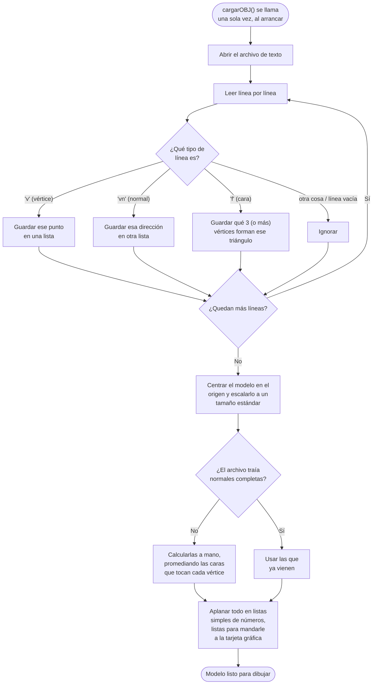
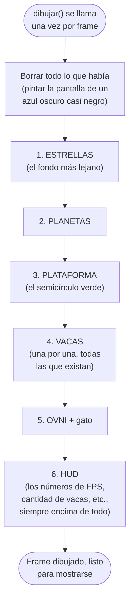
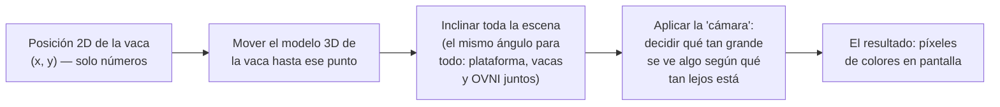
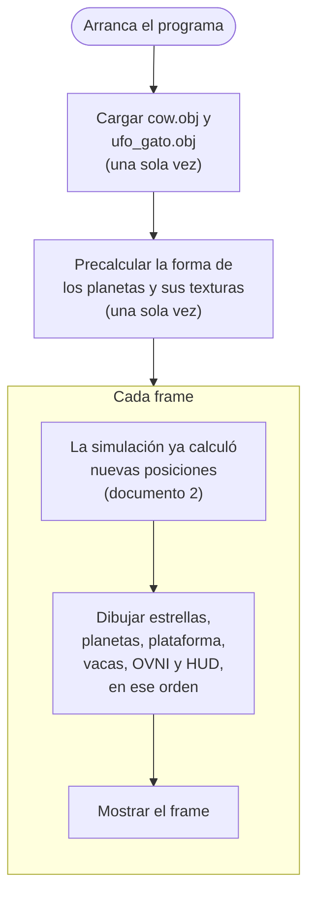

# Cómo funciona ZipZip — El renderizado (dibujar en pantalla)

Este documento asume que ya leíste
[`flujo_01_vision_general.md`](flujo_01_vision_general.md). Aquí vemos el
paso que ahí se llamó "DIBUJAR": cómo las posiciones que calculó la
simulación (documento 2) se convierten en la imagen que ves en pantalla.

Todo esto vive en `src/rendering/renderer.cpp`, con ayuda de
`src/assets/obj_loader.cpp` para cargar los modelos 3D.

## Primero: ¿cómo se carga una vaca desde un archivo?

Antes de poder dibujar una vaca, el programa necesita saber **qué forma
tiene**. Esa forma vive en un archivo de texto llamado `cow.obj`
(formato *Wavefront OBJ*, un formato viejo y simple para describir modelos
3D). Si lo abrieras con un editor de texto, verías líneas como:

```text
v 0.5 1.2 -0.3      <- un punto en el espacio (vertice)
vn 0.0 1.0 0.0      <- hacia dónde "mira" la superficie ahí (normal)
f 12 45 78          <- un triángulo, hecho conectando 3 vertices
```

`v` = *vertex* (vértice, un punto en el espacio 3D). `vn` = *vertex normal*
(hacia dónde apunta la superficie en ese punto — esto es lo que le permite a
la luz "rebotar" de forma realista). `f` = *face* (cara, un triángulo hecho
de 3 vértices). Un modelo como la vaca tiene cientos de estas líneas.



Este mismo proceso se usa **dos veces**: una para `cow.obj` (la vaca) y otra
para `ufo_gato.obj` (el OVNI con el gato). Ambos quedan guardados en memoria,
listos para reutilizarse en cada uno de los miles de frames — sin volver a
leer el archivo nunca más.

## La idea central: dibujar por capas, de atrás hacia adelante

Así como en una pintura tradicional primero se pinta el fondo y después los
elementos más cercanos (para que tapen correctamente lo que está detrás),
este programa dibuja la escena **en un orden fijo**, de lo más lejano a lo
más cercano:



¿Por qué en ese orden? Porque las cosas que se dibujan después **tapan** a
las que se dibujaron antes si están en frente. Si dibujaras el HUD primero,
las vacas lo taparían; si dibujaras las vacas antes que la plataforma, se
verían "flotando" sin nada debajo mientras se dibuja el piso encima de ellas.
El orden importa.

(Nota técnica para quien tenga curiosidad: además de este orden, OpenGL usa
algo llamado *prueba de profundidad* que compara qué tan lejos está cada
punto de la cámara, así que aunque el orden de dibujo importa para la
mayoría de las capas, dos objetos que se cruzan entre sí — como una vaca
frente a otra — sí se tapan correctamente según cuál esté más cerca de la
cámara, no según cuál se dibujó primero.)

## ¿Cómo se ve "3D" algo que en realidad son solo números?

Cada vaca, en la simulación (documento 2), es nada más dos números: su
posición `x` y `y`. Para que eso se vea como una vaca parada en un planeta
inclinado, hay que pasar por varios pasos:



Dos ideas importantes de este proceso:

- **La inclinación es una sola, y se aplica a todo por igual.** La
  plataforma, cada vaca y el OVNI se inclinan exactamente el mismo ángulo,
  en el mismo orden, antes de colocarse en su posición final. Por eso todo
  se ve "pegado" a la superficie inclinada del planeta, en vez de que cada
  cosa se vea flotando en un ángulo distinto.
- **Los objetos más cerca de la cámara se ven más grandes** — igual que en
  la vida real. El OVNI, por ejemplo, está colocado un poco más cerca de la
  cámara que las vacas a propósito, para que se vea "en frente" de ellas y
  un poco más grande (ver más abajo).

## Detalles curiosos de cómo se dibuja cada capa

### La plataforma (el semicírculo verde)

No es una imagen ni una textura — es geometría real, hecha de decenas de
triángulos pequeños en forma de abanico (como una pizza cortada en
rebanadas, pero solo la mitad). Tiene además una "falda" — una pared
adicional que le da grosor, para que se vea como un planeta sólido y no
como una cáscara plana sin espesor.

### Los planetas

Cada planeta es una esfera hecha de muchísimos cuadros pequeños (como una
pelota de fútbol, pero con muchas más caras). Esa forma se calcula **una
sola vez**, al arrancar el programa — no en cada frame — porque calcularla
de nuevo 60+ veces por segundo sería un desperdicio de tiempo enorme para
algo que nunca cambia de forma (solo gira).

Las texturas de los planetas (los colores y patrones que los hacen ver como
mundos distintos: uno nebuloso, uno oceánico, uno volcánico, uno gaseoso) se
generan con fórmulas matemáticas (senos, cosenos) en vez de venir de una
imagen descargada — también una sola vez, al arrancar.

### Las estrellas

Son puntos, no modelos 3D — mucho más simples que una vaca o un planeta.
Para dibujar cientos de puntos de forma eficiente, el programa las agrupa
por tamaño antes de dibujarlas (dibujar 200 puntos idénticos juntos es más
rápido que dibujarlos uno por uno).

### El HUD (los números en la esquina)

Los números y letras que ves (`FPS: 60.0`, `VACAS: 100`, etc.) no usan
ninguna fuente de texto del sistema operativo — el programa trae su propio
"alfabeto" hecho a mano: cada letra o número es un patrón de puntos
encendidos/apagados en una cuadrícula de 5x7, definido directamente en el
código. Es una forma sencilla de dibujar texto sin depender de librerías
externas de fuentes.

## Todo el proceso, resumido en un solo diagrama



## Resumen de los tres documentos

- **Documento 1**: el ciclo completo, arranque y cierre.
- **Documento 2**: cómo se mueven las vacas, y por qué se reparte ese
  trabajo entre varios hilos del procesador (el corazón del proyecto de
  Computación Paralela).
- **Documento 3** (este): cómo esos números se convierten en la imagen que
  ves en pantalla.

Con los tres juntos, el programa completo queda explicado de punta a punta:
desde que escribes `./zipzip` en la terminal, hasta el último píxel que se
dibuja en cada frame.
